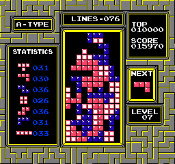

# gym-Tetris-bot

This code plays the game Tetris, provided by open-ai gym, on its own and does a pretty good job at it.

## Demo

## How Does it Work
This bot does not use any kind of Machine Learning for its purposes.
#### The way it works is that:
#### 1.Take in gym new states:
Once we start playing in the gym-tetris, we keep getting new states(How the tetris board looks),reward, done and information about the tetris board(which was liks this:curr_info = {'board_height': 0, 'statistics': {'Z': 0, 'O': 0, 'J': 0, 'T': 0, 'I': 0, 'S': 0, 'L': 0}, 'score': 0, 'current_piece': '', 'next_piece': '', 'number_of_lines': 0})
#### 2. Convert to Binary: 
These new states are converted to binary such that each pixel now represents one block. The presence of the block will be denoted by 1 and 0 denotes empty space.
#### 3. Find Best State: 
Now that we have the tetris board state and our current piece, we find all the possible new states. We evaluate these new states based on this metric :

#### a * (Aggregate Height) + b * (Complete Lines) + c *(Holes) + d * (Bumpiness)

a = -0.510066
b = 0.760666
c = -0.35663
d = -0.184483
from : https://codemyroad.wordpress.com/2013/04/14/tetris-ai-the-near-perfect-player/
#### 4. Play Best Action :
Now that we know the best state, we rotate the piece to match the best-state-orientation (by randomly moving because I haven't figured out the rotate button yet) and we move this piece to the best-state-location (by moving left or right).
And then we move down to that best state.

These steps are looped over and over until the game is over.

## Shortcomings:
#### Despite doing much better than what a human would do, the bot has a number of shortcomings:
1. With the O piece, the next states are not very accurate and causes it to not play optimally.
2. The Current piece is just blocked out by putting zeros into it at the top of the tetris board. This becomes a problem when the board height increases.
3. At very high scores, there seems to be some randomness in the moves .The bot cannot adjust to this randomness causing for a less than optimal move.

## Requirements

- gym-tetris (3.0.2)
- Opencv (4.1.0.25)
- Numpy (1.16.4)
- nes-py (8.1.1)
- Tqdm (4.31.1)

## Links :
1. https://codemyroad.wordpress.com/2013/04/14/tetris-ai-the-near-perfect-player/
2. https://github.com/nuno-faria/tetris-ai
3. http://cs231n.stanford.edu/reports/2016/pdfs/121_Report.pdf
4. https://pypi.org/project/gym-tetris/
